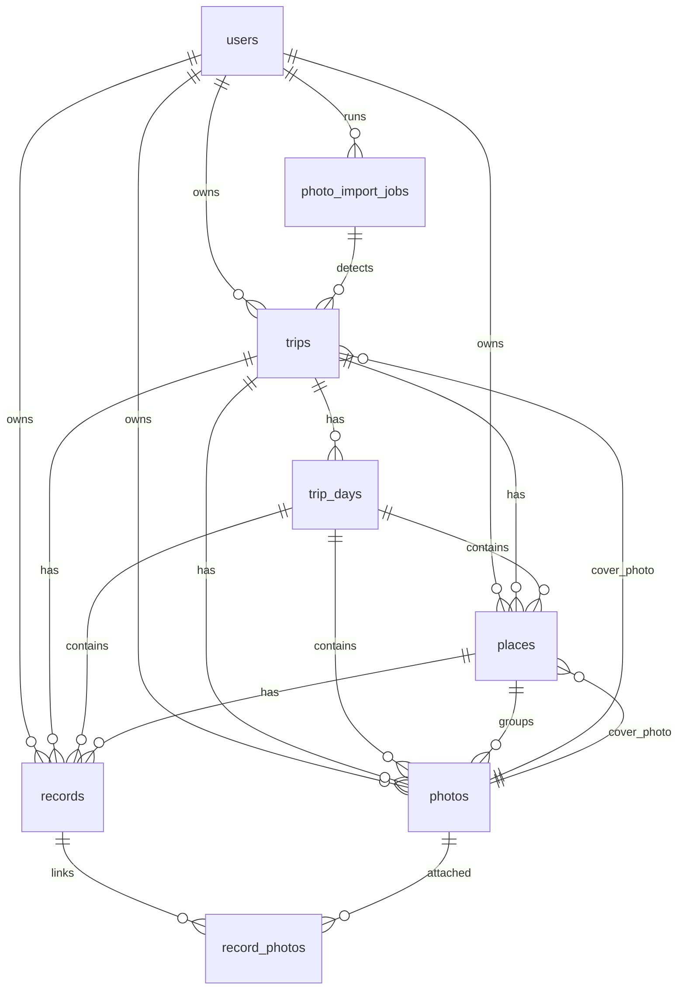

# Day 2 DB 설계 기준

작성일: 2026-07-03

이 문서는 Travu 백엔드/Supabase/Google API 연동 Day 2 작업의 기준 문서입니다.  
아직 실제 migration SQL은 작성하지 않고, Day 2에서 SQL migration과 service layer를 만들 때 따라야 할 데이터 설계 방향을 확정합니다.

## 1. 최종 테이블 목록

MVP 초기 기준 최종 테이블은 아래와 같습니다.

| 테이블 | 역할 | MVP 포함 여부 |
| --- | --- | --- |
| `users` | Supabase Auth 사용자와 앱 프로필 데이터 | 포함 |
| `trips` | 여행 단위 데이터. 감지 후보도 `status = 'detected'`로 관리 | 포함 |
| `trip_days` | 여행 날짜별 day 데이터 | 포함 |
| `places` | 여행 중 방문한 장소 정보 | 포함 |
| `photos` | Supabase Storage에 업로드된 사진 metadata | 포함 |
| `records` | 사용자가 장소에 남긴 개별 기록 | 포함 |
| `record_photos` | 기록과 사진의 N:N 연결 | 포함 |
| `photo_import_jobs` | 사진첩 여행 감지 작업 상태 | 포함 |

MVP 이후 분리 후보:

| 테이블 | 분리 시점 |
| --- | --- |
| `detected_trips` | 감지 후보의 상태/리뷰 이력/머지 로직이 복잡해질 때 |
| `place_categories` | 카테고리 다국어/사용자 커스텀이 필요해질 때 |
| `trip_collaborators` | 공유 여행/공동 편집이 필요해질 때 |

## 2. 각 테이블 필드 초안

### users

Supabase Auth의 `auth.users.id`를 앱 사용자 id로 사용합니다.

| 필드 | 타입 초안 | 필수 | 설명 |
| --- | --- | --- | --- |
| `id` | uuid PK | yes | `auth.users.id` 참조 |
| `name` | text | yes | 프로필 이름 |
| `based_in` | text | no | 표시용 기반 위치. 예: `Seoul, South Korea` |
| `based_in_city` | text | no | 구조화된 도시명 |
| `based_in_country` | text | no | 구조화된 국가명 |
| `based_in_country_code` | text | no | ISO 국가 코드 |
| `based_in_google_place_id` | text | no | Google place id |
| `based_in_latitude` | double precision | no | 기반 위치 위도 |
| `based_in_longitude` | double precision | no | 기반 위치 경도 |
| `bio` | text | no | 자기소개 |
| `travel_styles` | text[] | yes | 기본값 `{}` |
| `profile_image_url` | text | no | Storage avatar URL |
| `created_at` | timestamptz | yes | 기본 `now()` |
| `updated_at` | timestamptz | yes | update trigger 권장 |
| `deleted_at` | timestamptz | no | 계정 탈퇴 soft delete가 필요할 경우 사용 |

### trips

감지 후보, 여행 중, 저장 완료 여행을 모두 관리합니다.

| 필드 | 타입 초안 | 필수 | 설명 |
| --- | --- | --- | --- |
| `id` | uuid PK | yes | |
| `user_id` | uuid FK users.id | yes | RLS 기준 |
| `title` | text | yes | 여행 책자/상세 제목 |
| `destination_city` | text | no | 대표 도시 |
| `destination_country` | text | no | 대표 국가 |
| `destination_city_ko` | text | no | 한국어 표시용 |
| `destination_country_ko` | text | no | 한국어 표시용 |
| `start_date` | date | no | 감지 후보 단계에서는 nullable 가능 |
| `end_date` | date | no | 종료 미정/감지 후보 대응 |
| `is_end_date_undecided` | boolean | yes | 기본 `false` |
| `status` | text | yes | `detected`, `draft`, `active`, `archived`, `ignored` |
| `cover_photo_id` | uuid FK photos.id | no | 대표사진 |
| `photo_import_job_id` | uuid FK photo_import_jobs.id | no | 감지 job 출처 |
| `created_at` | timestamptz | yes | |
| `updated_at` | timestamptz | yes | |
| `deleted_at` | timestamptz | no | soft delete |

권장 제약:
- `status` check constraint 사용
- 사용자별 `status = 'active'` 여행은 1개만 허용할지 Day 2에서 검토

### trip_days

| 필드 | 타입 초안 | 필수 | 설명 |
| --- | --- | --- | --- |
| `id` | uuid PK | yes | |
| `trip_id` | uuid FK trips.id | yes | |
| `date` | date | yes | 실제 날짜 |
| `day_index` | integer | yes | 1일차부터 시작 |
| `created_at` | timestamptz | yes | |
| `updated_at` | timestamptz | yes | |
| `deleted_at` | timestamptz | no | soft delete |

권장 제약:
- `(trip_id, date)` unique where `deleted_at is null`
- `(trip_id, day_index)` unique where `deleted_at is null`

### places

장소 자체 정보만 저장합니다. 사용자가 남기는 기록은 `records`에 저장합니다.

| 필드 | 타입 초안 | 필수 | 설명 |
| --- | --- | --- | --- |
| `id` | uuid PK | yes | |
| `user_id` | uuid FK users.id | yes | RLS 및 쿼리 편의 |
| `trip_id` | uuid FK trips.id | yes | |
| `trip_day_id` | uuid FK trip_days.id | no | 날짜 미정/이동 대응 |
| `name` | text | yes | Google 원본 또는 수동 장소명 |
| `custom_name` | text | no | 사용자 수정 장소명 |
| `memo` | text | no | 장소 자체 메모. 개별 기록과 분리 |
| `address` | text | no | formatted address |
| `city` | text | no | 원본/영문 도시 |
| `country` | text | no | 원본/영문 국가 |
| `city_ko` | text | no | 한국어 도시 |
| `country_ko` | text | no | 한국어 국가 |
| `latitude` | double precision | no | |
| `longitude` | double precision | no | |
| `google_place_id` | text | no | |
| `google_types` | text[] | no | |
| `google_rating` | numeric | no | |
| `google_user_ratings_total` | integer | no | |
| `google_maps_url` | text | no | |
| `source` | text | yes | `google`, `manual`, `photo_cluster` |
| `cover_photo_id` | uuid FK photos.id | no | 장소 대표사진 |
| `visited_at` | timestamptz | no | 방문 시간/정렬 기준 |
| `created_at` | timestamptz | yes | |
| `updated_at` | timestamptz | yes | |
| `deleted_at` | timestamptz | no | soft delete |

### photos

사진 원본은 Supabase Storage에 업로드합니다.  
`local_uri`는 업로드 전 preview/임시값으로만 사용합니다.

| 필드 | 타입 초안 | 필수 | 설명 |
| --- | --- | --- | --- |
| `id` | uuid PK | yes | |
| `user_id` | uuid FK users.id | yes | RLS 기준 |
| `trip_id` | uuid FK trips.id | no | 감지 전/미분류 대응 |
| `trip_day_id` | uuid FK trip_days.id | no | |
| `place_id` | uuid FK places.id | no | |
| `image_url` | text | no | 최종 원본/표시 URL. 업로드 완료 후 필수 취급 |
| `thumbnail_url` | text | no | 그리드/카드용 |
| `local_uri` | text | no | 업로드 전 preview/임시 |
| `taken_at` | timestamptz | no | EXIF 촬영 시각 |
| `latitude` | double precision | no | EXIF GPS |
| `longitude` | double precision | no | EXIF GPS |
| `city` | text | no | reverse geocoding 결과 |
| `country` | text | no | reverse geocoding 결과 |
| `city_ko` | text | no | 한국어 표시용 |
| `country_ko` | text | no | 한국어 표시용 |
| `exif_data` | jsonb | no | 원본 metadata |
| `created_at` | timestamptz | yes | |
| `updated_at` | timestamptz | yes | |
| `deleted_at` | timestamptz | no | soft delete |

### records

사용자가 작성한 개별 기록을 저장합니다.

| 필드 | 타입 초안 | 필수 | 설명 |
| --- | --- | --- | --- |
| `id` | uuid PK | yes | |
| `user_id` | uuid FK users.id | yes | RLS 기준 |
| `trip_id` | uuid FK trips.id | yes | |
| `trip_day_id` | uuid FK trip_days.id | no | |
| `place_id` | uuid FK places.id | yes | |
| `text` | text | no | 기록 본문 |
| `visited_at` | timestamptz | no | 기록 시간/정렬 기준 |
| `created_at` | timestamptz | yes | |
| `updated_at` | timestamptz | yes | |
| `deleted_at` | timestamptz | no | soft delete |

주의:
- `places.memo`와 `records.text`를 혼동하지 않습니다.
- 기록 없는 장소도 가능해야 합니다.
- 사진 없는 기록도 가능해야 합니다.

### record_photos

기록과 사진의 연결 테이블입니다.

| 필드 | 타입 초안 | 필수 | 설명 |
| --- | --- | --- | --- |
| `id` | uuid PK | yes | |
| `record_id` | uuid FK records.id | yes | |
| `photo_id` | uuid FK photos.id | yes | |
| `sort_order` | integer | yes | 기록 내 사진 순서 |
| `created_at` | timestamptz | yes | |
| `deleted_at` | timestamptz | no | soft delete |

권장 제약:
- `(record_id, photo_id)` unique where `deleted_at is null`

### photo_import_jobs

사진첩 분석 작업의 상태를 저장합니다.

| 필드 | 타입 초안 | 필수 | 설명 |
| --- | --- | --- | --- |
| `id` | uuid PK | yes | |
| `user_id` | uuid FK users.id | yes | |
| `status` | text | yes | `queued`, `running`, `success`, `empty`, `error`, `permission_denied`, `cancelled` |
| `progress` | integer | yes | 0-100 |
| `started_at` | timestamptz | no | |
| `completed_at` | timestamptz | no | |
| `error_message` | text | no | |
| `metadata` | jsonb | no | 분석 옵션, 사진 수 등 |
| `created_at` | timestamptz | yes | |
| `updated_at` | timestamptz | yes | |
| `deleted_at` | timestamptz | no | soft delete |

감지된 여행 후보는 별도 `detected_trips` 테이블을 만들지 않고 `trips.status = 'detected'`로 관리합니다.

## 3. 테이블 관계



관계 원칙:
- 모든 주요 사용자 데이터는 `user_id`를 직접 가집니다.
- `trip_id`는 조회 성능과 RLS 보조를 위해 `places`, `photos`, `records`에도 중복 저장합니다.
- `trip_day_id`는 날짜 이동이 가능한 데이터를 위해 nullable로 둡니다.
- `cover_photo_id`는 `trips`, `places`에서 `photos.id`를 참조합니다.
- `record_photos`는 기록별 사진 연결만 담당합니다.

## 4. soft delete 적용 방식

적용 테이블:
- `trips`
- `trip_days`
- `places`
- `photos`
- `records`
- `record_photos`
- `photo_import_jobs`

기본 정책:
1. 삭제 시 row를 즉시 제거하지 않고 `deleted_at = now()`로 표시합니다.
2. 앱 조회 쿼리는 항상 `deleted_at is null` 조건을 포함합니다.
3. Storage 원본 파일은 MVP 초기에는 즉시 삭제하지 않습니다.
4. Storage cleanup은 별도 관리 작업 또는 Edge Function으로 분리합니다.
5. 부모 soft delete 시 자식 row도 같은 transaction에서 soft delete하는 service 함수를 둡니다.

삭제별 처리:

| 삭제 대상 | 처리 |
| --- | --- |
| 여행 삭제 | `trips.deleted_at`, 관련 `trip_days/places/photos/records/record_photos.deleted_at` 설정 |
| 장소 삭제 | `places.deleted_at`, 해당 장소의 records soft delete, 사진은 정책 결정 필요. MVP에서는 place 연결만 유지/숨김 우선 |
| 사진 삭제 | `photos.deleted_at`, `record_photos.deleted_at`, cover_photo_id 참조 정리 |
| 기록 삭제 | `records.deleted_at`, 연결 `record_photos.deleted_at` |

주의:
- soft delete 이후 `cover_photo_id`가 deleted photo를 가리키지 않도록 service layer에서 보정합니다.
- 화면에서는 deleted row가 절대 노출되지 않도록 React Query query function에서 필터를 표준화합니다.

## 5. Storage bucket/path 구조

### Buckets

| bucket | 용도 | public 여부 |
| --- | --- | --- |
| `photos` | 여행/장소/기록 사진 원본 및 thumbnail | private 권장 |
| `avatars` | 프로필 이미지 | public 또는 signed URL 정책 중 선택 |

MVP에서는 signed URL 관리가 복잡하면 `avatars`는 public, `photos`는 private + signed URL을 권장합니다.

### Path 구조

사진 원본:

```text
photos/{user_id}/{trip_id}/{photo_id}/original.{ext}
```

사진 썸네일:

```text
photos/{user_id}/{trip_id}/{photo_id}/thumb.{ext}
```

감지 전 임시 사진:

```text
photos/{user_id}/imports/{photo_import_job_id}/{photo_id}/original.{ext}
photos/{user_id}/imports/{photo_import_job_id}/{photo_id}/thumb.{ext}
```

프로필 이미지:

```text
avatars/{user_id}/profile.{ext}
avatars/{user_id}/profile-{timestamp}.{ext}
```

운영 원칙:
- `photos.local_uri`는 업로드 전 preview용입니다.
- DB 최종 표시 기준은 `image_url`, `thumbnail_url`입니다.
- 원본 파일 cleanup은 `deleted_at` 기준 별도 job으로 처리합니다.
- thumbnail 생성은 앱에서 업로드 전 생성할지 Edge Function에서 생성할지 Day 2 이후 결정합니다.

## 6. RLS 정책 방향

공통 원칙:
- 모든 사용자 데이터는 `auth.uid() = user_id` 기준으로 접근합니다.
- `record_photos`처럼 `user_id`가 없는 join 테이블은 record 또는 photo 소유권을 통해 접근합니다.
- soft deleted row는 일반 select에서 보이지 않게 합니다.

테이블별 방향:

| 테이블 | select | insert | update | delete |
| --- | --- | --- | --- | --- |
| `users` | 본인 row만 | 본인 id만 | 본인 row만 | 직접 delete보다 `deleted_at` update |
| `trips` | `user_id = auth.uid()` and `deleted_at is null` | 본인 user_id | 본인 row | soft delete update |
| `trip_days` | parent trip 소유자 | parent trip 소유자 | parent trip 소유자 | soft delete update |
| `places` | `user_id = auth.uid()` and not deleted | 본인 user_id | 본인 row | soft delete update |
| `photos` | `user_id = auth.uid()` and not deleted | 본인 user_id | 본인 row | soft delete update |
| `records` | `user_id = auth.uid()` and not deleted | 본인 user_id | 본인 row | soft delete update |
| `record_photos` | record/photo 소유자 | record/photo 소유자 | record/photo 소유자 | soft delete update |
| `photo_import_jobs` | `user_id = auth.uid()` | 본인 user_id | 본인 row | soft delete update |

Storage RLS 방향:
- `photos` bucket: path의 첫 segment `{user_id}`가 `auth.uid()`와 같을 때 접근 허용.
- `avatars` bucket: upload/update는 본인만, read는 public 또는 signed URL 정책에 맞춤.

## 7. Google API Edge Function 목록

Google Maps SDK만 앱에서 직접 사용합니다.  
서버용 Google API Key는 앱 코드에 노출하지 않습니다.

| Edge Function | 사용하는 Google API | 입력 | 출력 | 사용 화면 |
| --- | --- | --- | --- | --- |
| `google-places-autocomplete` | Places Autocomplete | `query`, `sessionToken`, `locationBias?`, `language?` | prediction list | 장소 추가, 장소 수정, 여행지 선택, Based in |
| `google-place-details` | Place Details | `placeId`, `sessionToken?`, `fields` | name, address, lat/lng, types, rating, maps url | 장소 저장/수정 |
| `google-nearby-search` | Nearby Search | `latitude`, `longitude`, `radius`, `type?`, `language?` | nearby place candidates | 사진 GPS 기반 장소 추천 |
| `google-reverse-geocode` | Reverse Geocoding | `latitude`, `longitude`, `language?` | city, country, countryCode, formatted address | 사진 감지, Based in 현재 위치 |
| `google-geocode` | Geocoding | `address` 또는 city/country | lat/lng, formatted address | 여행지 선택 fallback |

비용 관리 기준:
- Autocomplete는 session token을 사용합니다.
- Details는 저장 확정 시점에만 호출합니다.
- Nearby Search는 사진마다 호출하지 않고 좌표 clustering 후 호출합니다.
- Reverse Geocoding은 좌표를 grid/cache key로 묶어 중복 호출을 줄입니다.
- Edge Function 내부에서 response cache를 검토합니다.

## 8. Day 2에서 작성해야 할 SQL migration 범위

Day 2 migration에는 아래까지만 포함합니다.

1. extensions
   - `pgcrypto` 또는 Supabase 기본 uuid 생성 방식 확인
2. tables
   - `users`
   - `photo_import_jobs`
   - `trips`
   - `trip_days`
   - `places`
   - `photos`
   - `records`
   - `record_photos`
3. enum 또는 check constraints
   - `trips.status`
   - `places.source`
   - `photo_import_jobs.status`
4. foreign keys
   - 위 관계 기준으로 작성
5. indexes
   - `user_id`
   - `trip_id`
   - `trip_day_id`
   - `place_id`
   - `deleted_at`
   - `taken_at`
   - `visited_at`
   - `google_place_id`
6. partial unique indexes
   - `trip_days(trip_id, date) where deleted_at is null`
   - `trip_days(trip_id, day_index) where deleted_at is null`
   - `record_photos(record_id, photo_id) where deleted_at is null`
7. updated_at trigger
   - 모든 update 대상 테이블에 적용
8. RLS enable
   - 전체 테이블 RLS 활성화
9. MVP 기본 RLS policies
   - user-owned CRUD 기준
10. Storage bucket 생성 기준 문서화
   - 실제 bucket 생성은 Supabase dashboard 또는 SQL에서 진행할지 결정

Day 2 migration에 포함하지 않을 것:
- 실제 Google Edge Function 구현
- 실제 React Query 연결
- mock data 삭제
- 화면 UI 변경
- seed data 대량 작성
- Storage cleanup job

## 9. Day 2에서 코드를 수정하지 말아야 할 범위

Day 2는 DB 설계와 migration 기반을 만드는 날입니다. 아래는 수정하지 않습니다.

| 범위 | 이유 |
| --- | --- |
| 디자인/레이아웃/색상/폰트/간격 | 현재 화면 구현 보존 |
| mock data 삭제 | 실제 API 연결 전 fallback 필요 |
| record-day-detail/archive-day-detail/place-detail 대규모 리팩터링 | DB schema 확정 후 service layer부터 연결 |
| 사진 그리드/전체 뷰어 navigation | 최근 안정화된 흐름 보존 |
| 장소 추가/기록 추가 UI 구조 | DB write service 준비 후 연결 |
| Google Maps SDK 화면 적용 | Edge Function/DB 필드 확정 후 진행 |
| Supabase realtime | MVP 이후 |
| Storage cleanup 자동화 | soft delete 이후 별도 작업 |

Day 2에서 허용되는 코드 수정:
- Supabase client 초기화 파일
- 환경 변수 타입/설정 파일
- DB 타입 초안 또는 generated type 위치 준비
- service layer skeleton
- React Query provider 추가가 필요하다면 앱 루트에 최소 변경
- migration 파일 추가

## Day 2 작업 기준 요약

1. records는 별도 테이블로 둔다.
2. record-photos 연결은 `record_photos`로 관리한다.
3. MVP 삭제는 soft delete다.
4. 원본 Storage 파일은 즉시 삭제하지 않는다.
5. 사진 최종 표시 기준은 `image_url`, `thumbnail_url`이다.
6. 감지 후보는 `trips.status = 'detected'`로 시작한다.
7. `photo_import_jobs`는 만든다.
8. Google server API key는 Edge Function에만 둔다.
9. 서버 데이터는 React Query로 조회/cache한다.
10. 모달/form/선택 상태는 기존처럼 local state 중심으로 유지한다.
